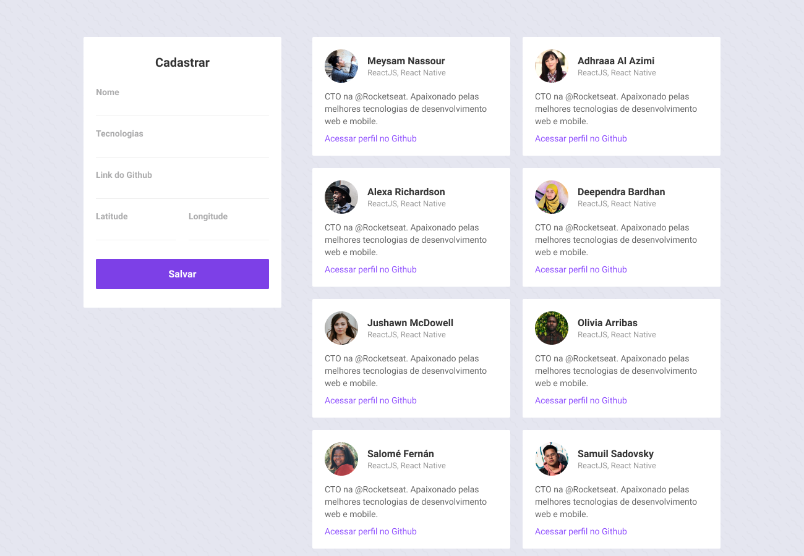
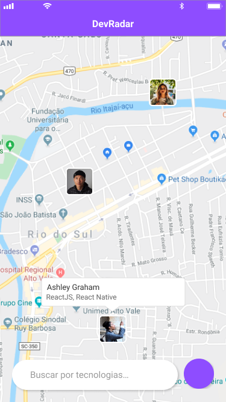
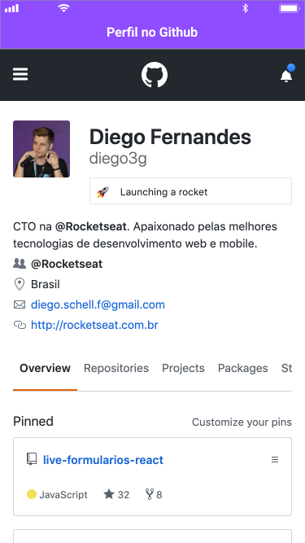

# 🌎 DevRadar

### ℹ Sobre
O DevRadar, desenvolvido durante a décima edição da semana omnistack, é uma aplicação para unir desenvolvedores. O objetivo é que cada um deles seja um ponto no mapa, e com o toque o seu perfil no GitHub será acessado.

Dessa forma, podemos estimular o networking entre desenvolvedores!

### 🛠 Tecnologias Utilizadas
- Node.js
- ReactJS
- React Native

### 🌐 Web
Interface Web, onde os desenvolvedores podem ser cadastrados.

 

### 📱 Mobile
Interface Mobile, onde os desenvolvedores podem ser visualizados no mapa, filtrados e detalhados.
<div align="left">
    
    
</div>

### 👨‍💻 Como utilizar
É necessário ter na sua máquina
- Node.js, e um gerenciador de pacotes (npm / yarn) para interpretar o código e instalação dedependências.
- Expo, para execução do mobile.

```sh
# Acessando o backend
$ cd backend
# Para instalar todas as dependências, execute:
$ npm install
# Para criar o banco de dados da aplicação, execute:
$ npm run dev

#Acessando web
$ cd web
# Instalando depêndencias
$ npm install
# Iniciando web
$ npm start

# Acessando o mobile
$ cd mobile
# Instalando depêndencias
$ npm install
# Iniciando mobile
$ npm start
```

### 📄 Licença
Hospedado sob a licença MIT.
